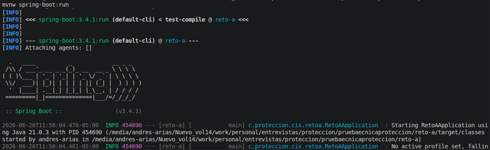
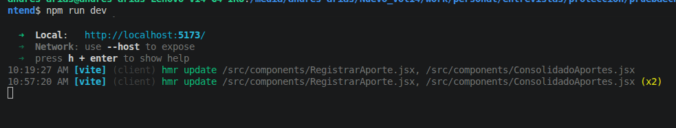
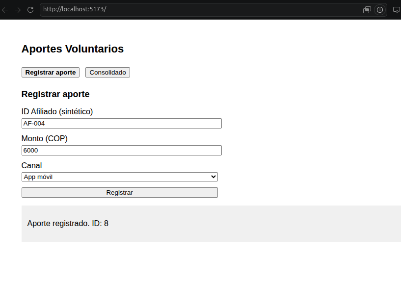
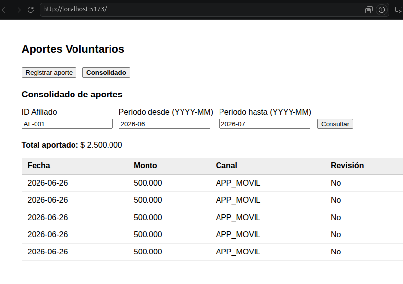
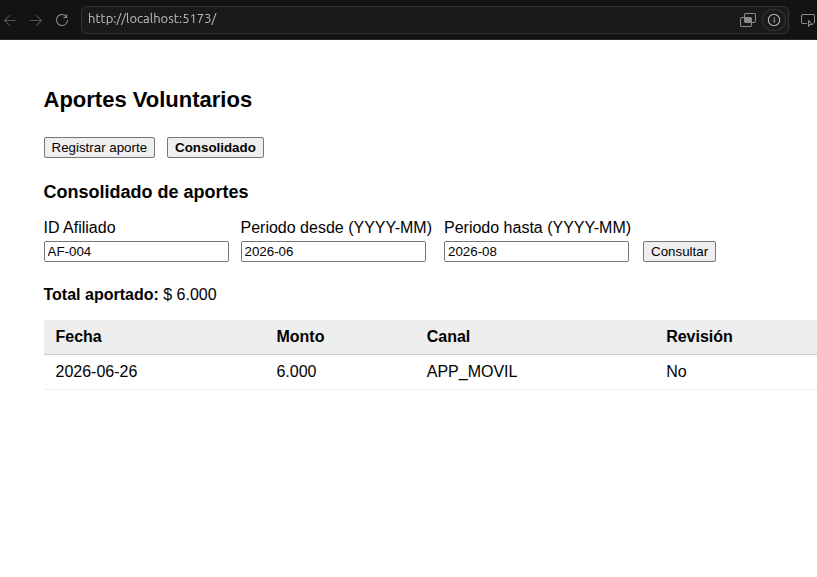

# Prueba Técnica AI-First · CIS Protección S.A.

Repositorio base para la prueba técnica de nivel senior del Centro de Ingeniería de Software (CIS).

## Estructura del repositorio

```
pruebaecnicaproteccion/
├── reto-a/          # Módulo a auditar — Spring Boot con defectos deliberados
└── reto-b/
    ├── backend/     # Scaffold Spring Boot (Clean Architecture) para implementar
    └── frontend/    # Scaffold React + Vite para implementar
```

## Requisitos previos

- Java 21
- Maven 3.9+
- Node 20+
- Docker y Docker Compose (para Reto B)

## Reto A — Auditoría de código

El módulo `reto-a` es un servicio de registro de aportes a un fondo voluntario.
**Compila y los tests felices pasan.** Tu trabajo es revisarlo como si fuera un MR de tu célula.

```bash
cd reto-a
./mvnw test        # Verifica que los tests pasan
./mvnw spring-boot:run  # Levanta el servicio (puerto 8080, H2 en memoria)
```

Endpoints disponibles para exploración manual:

```
POST http://localhost:8080/api/aportes
GET  http://localhost:8080/api/aportes/consolidado?afiliadoId=AF-001&periodo=2025-06
```

Payload de ejemplo para el POST:
```json
{
  "afiliadoId": "AF-001",
  "monto": 500000.0,
  "canal": "APP_MOVIL"
}
```

## Reto B — Construcción asistida

### Base de datos (PostgreSQL vía Docker)

```bash
docker compose up -d
```

Esto levanta PostgreSQL en `localhost:5432` con base de datos `proteccion_reto`, usuario `postgres`, contraseña `postgres`.

### Backend

```bash
cd reto-b/backend
./mvnw test        # Verifica que los tests pasan
./mvnw spring-boot:run   # Puerto 8082
```

### Frontend

```bash
cd reto-b/frontend
npm install
npm run dev              # Puerto 5173
```

## Instrucciones para candidatos

1. **No hagas fork.** Clona este repositorio directamente.
2. Crea una rama con tu nombre en formato `candidato/nombre-apellido`:
   ```bash
   git checkout -b candidato/maria-garcia
   ```
3. **Reto A:** Documenta tus hallazgos en `reto-a/HALLAZGOS.md`. No modifiques el código del módulo a auditar.
4. **Reto B:** Implementa la funcionalidad en `reto-b/`. Puedes y debes apoyarte en IA.
5. Conserva tus prompts y notas en `reto-b/NOTAS_PROCESO.md`. Son parte de la entrega.
6. Sube tu rama al repositorio remoto cuando termines:
   ```bash
   git push origin candidato/maria-garcia
   ```

## Stack de referencia CIS

- **Backend:** Spring Boot 3.4.x · Java 21 · Spring Data JPA · PostgreSQL
- **Frontend:** React 18 · Vite · fetch nativo
- **Arquitectura:** Clean Architecture · SOLID · CQRS
- **Seguridad:** OWASP Top 10 · manejo correcto de dinero (BigDecimal) · idempotencia

> Usa datos sintéticos en todo momento. Nunca uses ni inventes información personal real.

## Prompts utilizados durante la sesión

1. **Crear archivo de prompts**
   > Crea dentro de la carpeta un archivo .md donde se van a ir agregando los prompts.

2. **Crear agente code-reviewer**
   > Crea un agente que sea un experto en revisión de código que genere lista de hallazgos, ubicación, severidad (crítica / alta / media / baja), por qué es un problema y cómo lo corregirías.

3. **Agregar prompts al README**
   > Agrega los prompts escritos en el archivo readme.


4. proyecto arrancando
banckend


frontend



aporte



consolidado




