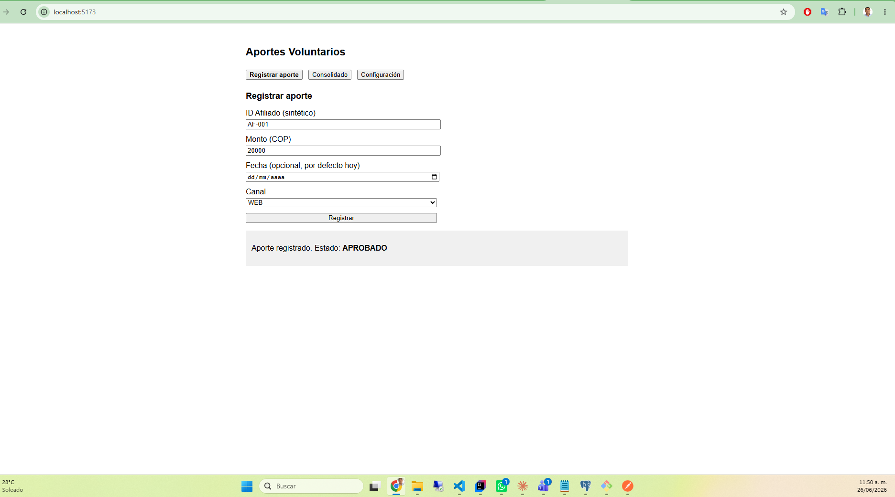
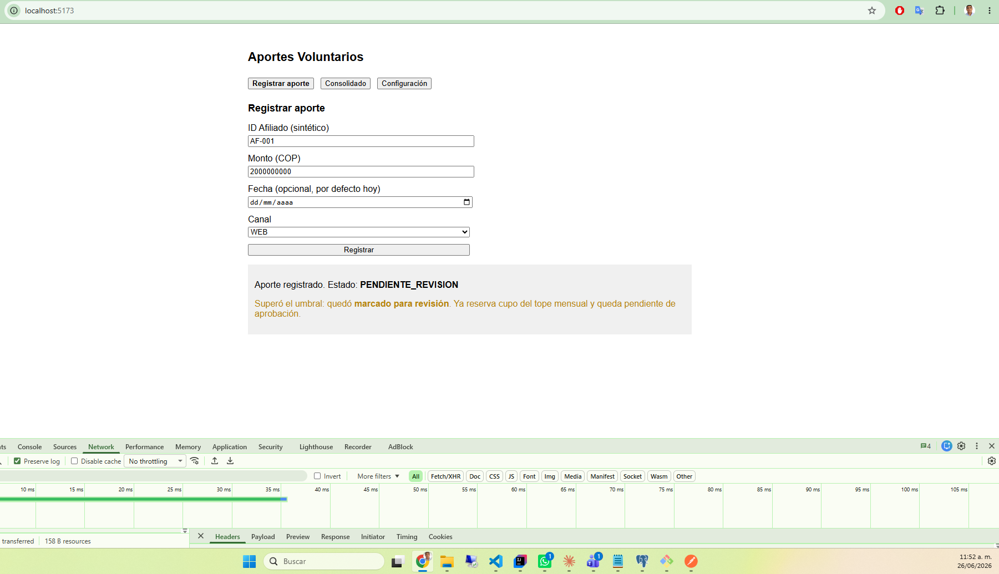
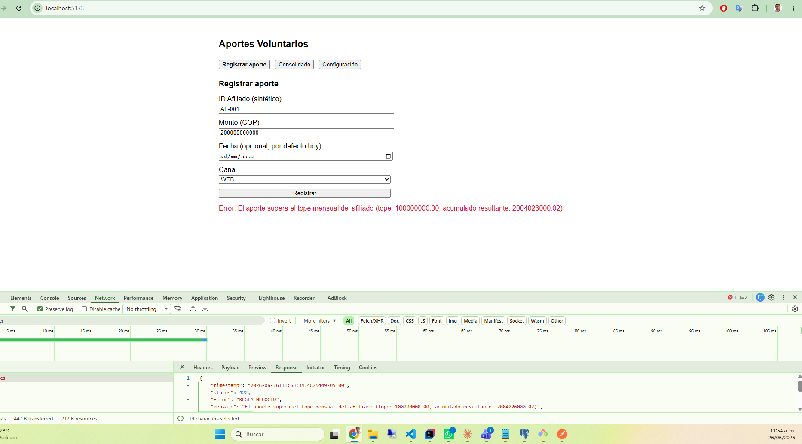
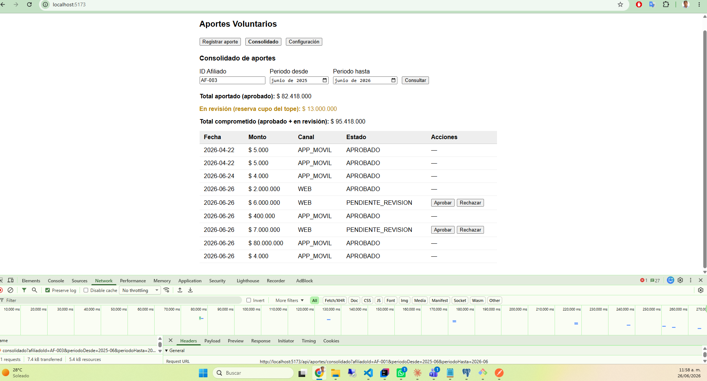
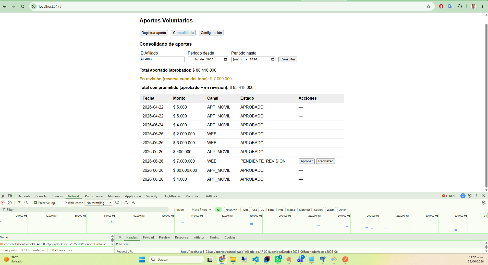
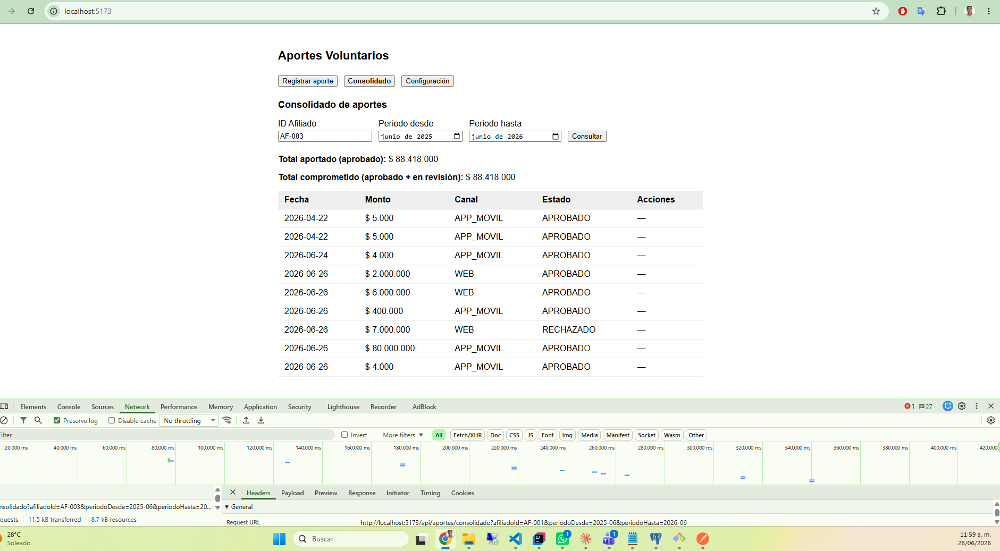
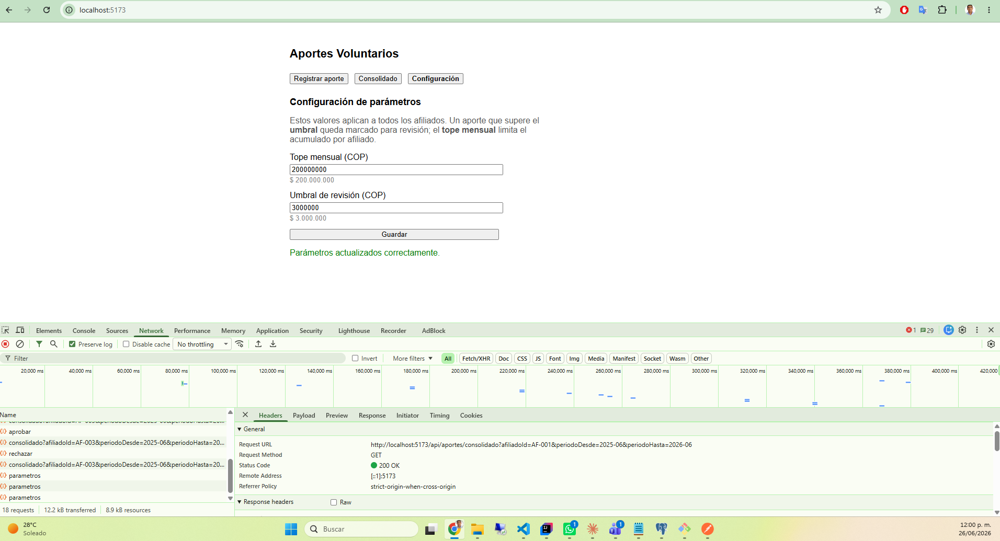
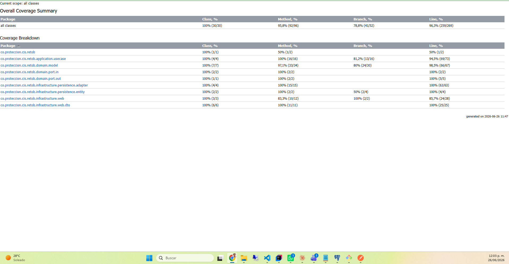

# Reto B — Notas de proceso y decisiones de ingeniería

Registro y consulta de aportes voluntarios sobre el scaffold provisto
(Spring Boot 3.4 · Java 21 · PostgreSQL · React + Vite).

## 1. Cómo se abordó

Se tomó como base el scaffold entregado, que ya incluía un proyecto Spring Boot con estructura de Clean Architecture (puertos/adaptadores) y un proyecto React + Vite para el frontend. 
Se definieron los requerimientos de negocio y con ello se creo un plan de implementación con claude que siguió la siguiente secuencia:

Orden de implementación: BD/migración → dominio → adaptadores JPA → casos de uso
(registro, consulta, aprobación) → capa web + manejo de errores → frontend → pruebas.

El reto fue trabajando con apoyo de IA Claude-code

## 2. Prompt inicial para dar contexto a la IA
Eres un desarrollador senior con experiencia en Java, Spring Boot y React. Se te entrega un scaffold de proyecto con estructura de Clean Architecture (puertos/adaptadores) y un proyecto React + Vite para el frontend. Tu tarea es implementar un sistema de registro y consulta de aportes voluntarios, siguiendo los requerimientos de negocio proporcionados. Debes generar código limpio, bien estructurado y documentado, asegurando que se cumplan las reglas de negocio y se manejen adecuadamente los errores. Además, debes escribir pruebas unitarias e integrales para garantizar la calidad del código.
Contexto: El desarrollo se requiere en una empresa de servicios financieros, por lo que se deben considerar aspectos de seguridad, idempotencia y manejo de datos sensibles. Se espera que el sistema sea escalable y mantenible, con una arquitectura clara y modular.

## 3. Requisitos de negocio y solicitud de plan
Prompt:
Requiero un plan de implementación de frontend y backend para un sistema de registro y consulta de aportes voluntarios, siguiendo los siguientes requerimientos de negocio:
La funcionalidad: registro y consulta de aportes voluntarios
• Registrar un aporte de un afiliado (identificado por un id sintético) a un fondo voluntario:
monto, fecha y canal de origen. La operación debe ser idempotente.
• Reglas de negocio: el monto debe ser positivo; existe un tope mensual por afiliado
(parámetro configurable); un aporte que supere un umbral definido debe quedar marcado para
revisión posterior. Aportes que violen las reglas se rechazan con un mensaje claro.
• Consultar el consolidado de aportes de un afiliado en un periodo (total y detalle).
• Vista React: un formulario para registrar un aporte y una tabla con el consolidado. No necesita ser bonito; necesita ser correcto y razonable.
 
usa mis skills locales para generar un plan completo.
 
## 4. Desviaciones respecto del scaffold (intencionales)

1. **Parámetros en BD** en lugar de `@Value` sobre `application.properties`
   (migración `V2`, puerto `ParametroAportePort` + adaptador).

De esta manera se pueden cambiar los parametros en tiempo de ejecución, es mucho mas util en un entorno de producción.

2. **Estados de aporte** (`EstadoAporte`: `APROBADO` / `PENDIENTE_REVISION` / `RECHAZADO`)
   y **flujo de aprobación** (`AprobarAporteUseCase` + endpoints `/{id}/aprobar` y
   `/{id}/rechazar`). Bajo el modelo de reserva, el pendiente ya descontó cupo: aprobar
   no toca el saldo y rechazar lo libera. El booleano `marcada_revision` se conserva pero
   se **deriva** del estado.

Este manejo de estados permite tener un flujo de aprobación más claro y controlado, asegurando que los aportes sean revisados adecuadamente antes de ser aprobados o rechazados.

## 5. Reglas de negocio

Se mantienen las reglas descritas en el ejercicio solicitado, con las siguientes precisiones:

- Monto debe ser positivo → validado en el DTO (`@DecimalMin`) **y** en el dominio
  (`Aporte.nuevo`), defensa en profundidad.
- `monto > umbral` ⇒ `PENDIENTE_REVISION`; igual reserva cupo (impacta el saldo).
- **Todo** aporte valida `saldo(aprobados + pendientes) + monto ≤ tope`; si excede ⇒ rechazo 422.
- Aprobar un pendiente **no** cambia el saldo (ya reservado); rechazar **libera** la reserva.
- Consolidado: `totalAportado` = suma de aprobados; `totalEnRevision` aparte; el detalle
  incluye todos con su estado.

## 6. Manejo de errores (HTTP)

El manejo de errores centralizado permite que la API devuelva respuestas uniformes y claras ante diferentes tipos de errores.

`GlobalExceptionHandler` traduce: validación → **400**, regla de negocio (tope/transición)
→ **422**, aporte inexistente → **404**, inesperado → **500**. Cuerpo uniforme `ErrorResponse`.

## 7. Pruebas (backend: 32 · frontend: 16, todas verdes)

**Backend (`mvn test`):**

- **Dominio (unitarias)**: invariantes de `Aporte` (monto positivo, periodo derivado,
  transiciones válidas/ inválidas) y de `ParametrosAporte` (positivos, umbral ≤ tope).
- **Casos de uso (Mockito)**: idempotencia, umbral→pendiente reservando cupo,
  dentro de tope→incrementa saldo, exceso de tope→rechazo (incluido un pendiente que
  excede), aprobación sin tocar saldo, rechazo que libera la reserva.
- **Integración web (`@SpringBootTest` + H2 + MockMvc)**: contrato HTTP completo —
  201, idempotencia (mismo id, un solo registro), 400 por monto cero, 422 por tope,
  pendiente que reserva cupo y bloquea un aporte posterior, rechazo que libera cupo,
  ciclo pendiente→aprobado reflejado en el consolidado, y configuración de parámetros
  (lectura, actualización runtime y validaciones).

**Frontend (`npm test`, Vitest + React Testing Library):**

- **API (`aportesApi`)**: métodos hacen el request correcto (URL/método/cuerpo) y
  propagan el mensaje de error del backend (incluido el detalle por campo).
- **Componentes**: `RegistrarAporte` valida monto, muestra el estado sin exponer el id
  de BD, y **reutiliza la `idempotenciaKey` tras un fallo / genera una nueva tras el
  éxito**; `ConsolidadoAportes` precarga el rango de 1 año, calcula el total comprometido
  y permite aprobar desde la tabla; `Configuracion` carga, guarda y valida (umbral ≤ tope).

Qué quedó **deliberadamente fuera** por alcance: autenticación/autorización, paginación
del detalle, e idempotencia con expiración/TTL de claves. Se documentan como límites
conscientes, no como olvidos.

## 8. Uso de IA

El desarrollo se asistió con IA (Claude - code) para: análisis del scaffold, diseño del modelo
de estados y de la estrategia de concurrencia/idempotencia, generación del plan de acción, generación de código y ejecucion
pruebas. Las decisiones de negocio (umbral reserva cupo del tope, parámetros en BD,
idempotencia por clave explícita) se tomaron y validaron explícitamente antes de codificar.

## 9. Evidencias

1. Registro de un aporte válido

2. Registro de un aporte que excede el umbral y queda pendiente de revisión

3. Registro de un aporte que excede el tope y es rechazado

4. Consulta del consolidado de aportes de un afiliado

5. Aprobación de un aporte pendiente

6. Rechazo de un aporte pendiente que libera el cupo

7. Modificacion de parámetros de negocio en tiempo de ejecución

8. Cobertura de pruebas unitarias

## 9. Qué falta para producción en un entorno SFC

- **Observabilidad**: logs estructurados con `traceId`, métricas (Micrometer/Prometheus), health checks (Actuator) y trazas distribuidas; alertas sobre rechazos y pendientes.
- **Seguridad**: autenticación/autorización (OAuth2/JWT por rol; aprobar/rechazar solo revisores), HTTPS, secretos fuera del repo (vault/env) y auditoria
- **Idempotencia a escala**: clave con TTL/expiración, índice y limpieza de claves, e idempotencia consistente detrás de varias instancias.
- **Manejo de datos**: retención y archivado, particionado de `aporte` por periodo, respaldos y migraciones controladas (Flyway en CI/CD).
- **Resiliencia y operación**: reintentos/circuit breakers, rate limiting, pruebas de carga/concurrencia y despliegue con healthchecks y rollback.
