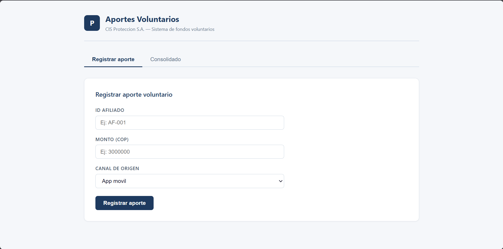
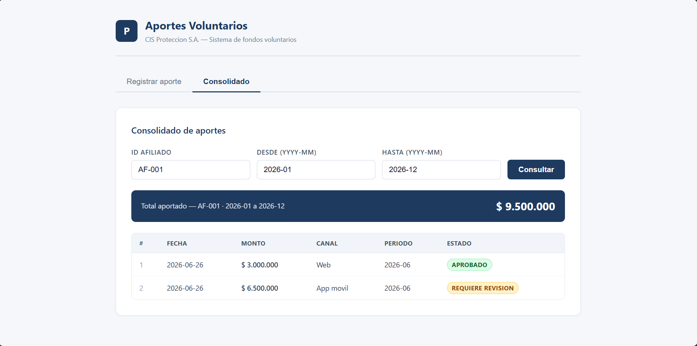
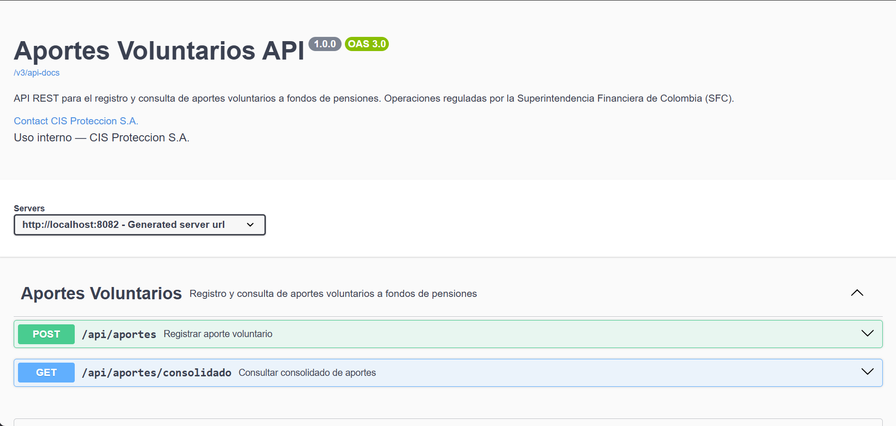

# Reto B — Registro y Consulta de Aportes Voluntarios

**CIS Proteccion S.A. — Prueba Tecnica AI-First**
Candidato: Tomas Rios | Rama: `candidato/tomas-rios`

---

## Como ejecutar el proyecto

**Prerequisito:** Docker Desktop corriendo.

```bash
# 1. Levantar base de datos PostgreSQL
cd reto-b
docker compose up -d

# 2. Backend (puerto 8082)
cd backend
./mvnw spring-boot:run

# 3. Frontend (puerto 5173)
cd frontend
npm install
npm run dev
```

UI disponible en `http://localhost:5173` — el proxy de Vite redirige `/api` al backend automaticamente.

---

## Ejemplos de uso (curl)

```bash
# Registrar un aporte normal
curl -X POST http://localhost:8082/api/aportes \
  -H "Content-Type: application/json" \
  -d '{"afiliadoId":"AF-001","monto":3000000,"canal":"WEB","idempotenciaKey":"uuid-001"}'

# Registrar aporte que requiere revision (monto > $5.000.000)
curl -X POST http://localhost:8082/api/aportes \
  -H "Content-Type: application/json" \
  -d '{"afiliadoId":"AF-001","monto":6000000,"canal":"APP_MOVIL","idempotenciaKey":"uuid-002"}'
# Respuesta incluye: "marcadaRevision": true

# Mismo idempotenciaKey: retorna el aporte original sin duplicar
curl -X POST http://localhost:8082/api/aportes \
  -H "Content-Type: application/json" \
  -d '{"afiliadoId":"AF-001","monto":3000000,"canal":"WEB","idempotenciaKey":"uuid-001"}'

# Consultar consolidado por periodo
curl "http://localhost:8082/api/aportes/consolidado?afiliadoId=AF-001&periodoDesde=2026-01&periodoHasta=2026-12"
```

---

## Estado del proyecto al inicio de la sesion (2026-06-26)

El proyecto base fue entregado con el scaffolding de arquitectura hexagonal completo pero con
la logica de negocio intencionalmente vacia (stubs con `throw new UnsupportedOperationException`).

### Lo que venia pre-construido

**Backend (Spring Boot 3.4.1 / Java 21):**
- Modelos de dominio inmutables: `Aporte`, `SaldoMensual`, `ConsolidadoAportes`
- Interfaces de puertos (hexagonal): `RegistrarAporteUseCase`, `ConsultarAportesUseCase`, `AporteRepositoryPort`, `SaldoRepositoryPort`
- Entidades JPA: `AporteEntity` (con `@PrePersist`), `SaldoMensualEntity` (con `@Version` para locking optimista)
- Repositorios Spring Data: `SpringDataAporteRepository`, `SpringDataSaldoRepository`
- Controller REST: `AporteController` — `POST /api/aportes` y `GET /api/aportes/consolidado`
- DTOs con validacion Jakarta: `RegistrarAporteRequest`, `AporteResponse`, `ConsolidadoResponse`
- Migracion Flyway (`V1__init.sql`): tablas `aporte`, `saldo_mensual`, `evento_aporte` con restriccion `UNIQUE(idempotencia_key)`
- `application.properties` con `aporte.tope-mensual=10000000` y `aporte.umbral-revision=5000000`
- Test de contexto con H2

**Frontend (React 18 + Vite):**
- `App.jsx`: navegacion entre dos vistas (registrar / consolidado)
- `RegistrarAporte.jsx`: formulario completo con estado, genera `crypto.randomUUID()` para idempotencia
- `ConsolidadoAportes.jsx`: formulario de busqueda y tabla de resultados
- `vite.config.js`: proxy `/api` apuntando a `http://localhost:8082`

### Lo que faltaba por implementar

| Componente | Gap |
|------------|-----|
| `JpaAporteRepositoryAdapter` | Stubs sin mapeo entidad <-> dominio |
| `JpaSaldoRepositoryAdapter` | Stubs sin mapeo + sin propagacion de `OptimisticLockException` |
| `RegistrarAporteUseCaseImpl` | Sin logica de negocio (idempotencia, tope, revision, transaccion) |
| `ConsultarAportesUseCaseImpl` | Sin implementacion de la consulta y agregacion |
| `GlobalExceptionHandler` | Inexistente — errores no llegaban con HTTP codes correctos |
| Configuracion CORS | Inexistente — frontend bloqueado en produccion |
| `aportesApi.js` | Ambas funciones lanzaban `Error` inmediatamente |

---

## Plan de implementacion ejecutado

| Paso | Descripcion | Commit |
|------|-------------|--------|
| 0 | Crear `CLAUDE.md` y `README.md` | `feat(reto-b): agregar documentacion tecnica` |
| 1 | Adaptadores JPA — mapeo entidad <-> dominio | `feat(reto-b): implementar adaptadores JPA` |
| 2 | Logica de negocio en los casos de uso | `feat(reto-b): implementar logica de negocio` |
| 3 | `GlobalExceptionHandler` + CORS | `feat(reto-b): agregar manejo de excepciones y CORS` |
| 4 | Cliente HTTP del frontend (`aportesApi.js`) | `feat(reto-b): implementar cliente HTTP del frontend` |

---

## Decisiones tecnicas clave

| Decision | Justificacion |
|----------|---------------|
| `BigDecimal` para montos | Precision decimal exacta requerida por regulacion SFC — `double` tiene errores de redondeo |
| `@Version` en `SaldoMensualEntity` | Previene race conditions si dos requests del mismo afiliado llegan simultaneamente |
| `UNIQUE(idempotencia_key)` en DB | La restriccion a nivel de base de datos es la garantia final de idempotencia — no depende solo del codigo |
| Idempotencia verificada en el use case | Es una regla de negocio, no un concern HTTP |
| `IllegalArgumentException` como excepcion de dominio | El dominio no conoce HTTP — el `GlobalExceptionHandler` hace la traduccion a 422 |
| `fetch` nativo (sin Axios) | Dependencias minimas; el proxy de Vite elimina problemas de CORS en desarrollo |

---

## Prompts utilizados en la sesion de reconocimiento (2026-06-26)

### Prompt 1 — Reconocimiento inicial y diagnostico

> Actua como un Tech Lead Senior en el Centro de Ingenieria de Software (CIS) de Proteccion S.A.
> Estamos desarrollando la funcionalidad del Reto B: "Registro y consulta de aportes voluntarios"
> bajo un enfoque AI-first, usando Spring Boot, PostgreSQL y React.
>
> Nuestra prioridad absoluta es la correccion numerica, la seguridad, la inmutabilidad y la
> idempotencia, operando bajo las regulaciones de la Superintendencia Financiera de Colombia (SFC).
>
> Dado que tienes acceso local a este repositorio (carpeta reto-b), necesito que realices un
> analisis de reconocimiento inicial de los proyectos base de Backend (Spring Boot) y Frontend
> (React). No modifiques ningun archivo todavia.
>
> Por favor, ejecuta un escaneo del workspace y entregame un reporte con la siguiente estructura:
>
> 1. DIAGNOSTICO DEL ESTADO ACTUAL: estructura de carpetas, componentes pre-construidos, dependencias clave.
> 2. BRECHA DE IMPLEMENTACION (GAP ANALYSIS): que falta por codificar en cada capa.
> 3. HOJA DE RUTA PROPUESTA (STEP-BY-STEP): plan de ejecucion incremental de 4 o 5 pasos.

### Prompt 2 — Documentacion previa al inicio

> Con el plan que construiste crea antes la documentacion necesaria para llevar el seguimiento
> de la refactorizacion o la culminacion del proyecto, crea un CLAUDE.md con las instrucciones
> tecnicas que debemos de darle al agente y un README.md con una guia practica sobre el estado
> en que se encontro el proyecto, el plan a implementar y los prompts utilizados en esta sesion.
> Para el CLAUDE.md agrega la instruccion de realizar commits estrictamente a la rama
> "candidato/tomas-rios", la estructura de los commits debe ser feat(reto-b): descripcion
> o fix(reto-b): descripcion.

### Prompt 3 — Implementacion completa

> Procede

### Prompt 4 — Levantar servicios

> Levanta el proyecto y dejame las url del back y el front para testear

### Prompt 5 — Pulido final

> Actua como nuestro Tech Lead Senior. Vamos a pulir y llevar a un nivel superior el Reto B
> antes de dar por cerrado el modulo practico. Agrega documentacion Swagger/OpenAPI con
> springdoc-openapi, mejora la interfaz React con validaciones visuales y alertas contextuales
> y CSS profesional sin dependencias externas, y prepara las secciones de evidencias visuales
> en el README con carpeta docs/images/.

### Prompt 6 — Sprint de Madurez Técnica, Cumplimiento SFC y Observabilidad

> Actúa como nuestro Tech Lead Senior. Vamos a implementar de inmediato el plan de madurez técnica para el Reto B enfocado en las tres funcionalidades prioritarias que identificaste (#2, #4 y #6). Esto elevará el nivel de la solución ante los estándares del CIS y la SFC sin sobrecomplicar el Lead Time[cite: 1].
>
> Por favor, ejecuta los siguientes cambios de manera secuencial:
>
> 1. ENUM PARA CANAL DE APORTE (Funcionalidad #4):
>    - Crea el enum `CanalAporte` con los valores `WEB`, `APP_MOVIL`, `SUCURSAL` en la capa de dominio (`domain/model/`).
>    - Actualiza el modelo `Aporte`, la entidad `AporteEntity` y el DTO `RegistrarAporteRequest` para utilizar este enum en lugar de un String libre[cite: 2].
>    - Asegúrate de que los mappers y la validación de Jackson manejen correctamente la conversión[cite: 2].
>
> 2. ENDPOINT DE COMPLIANCE / REVISIÓN (Funcionalidad #2):
>    - Agrega en `SpringDataAporteRepository` el método `findByMarcadaRevisionTrue()`[cite: 2].
>    - Expón esta consulta creando un nuevo método en el puerto de salida, un caso de uso específico de lectura (cumpliendo CQRS), y un endpoint limpio en el controlador: `GET /api/aportes/pendientes-revision`[cite: 2].
>    - Documenta brevemente el endpoint en el controlador con las anotaciones de Swagger indicando que su propósito es el cumplimiento normativo SFC[cite: 1, 2].
>
> 3. ACTUATOR Y OBSERVABILIDAD (Funcionalidad #6):
>    - Agrega la dependencia `spring-boot-starter-actuator` en el pom.xml del backend[cite: 2].
>    - En `application.properties`, configura para que únicamente se exponga el endpoint de salud de forma segura[cite: 2]:
>      ```properties
>      management.endpoints.web.exposure.include=health
>      management.endpoint.health.show-details=always
>      ```
>
> 4. ACTUALIZACIÓN DE DOCUMENTACIÓN:
>    - Añade estas tres características en la tabla del plan de implementación ejecutado en tu README.md, detallando su valor técnico/regulatorio[cite: 2].
>
> REGLA DE COMMIT ESTRICTA:
> Realiza commits atómicos para cada hito usando la convención pactada[cite: 2]:
> - "feat(reto-b): tipar canal de aporte como enum en el dominio"[cite: 2]
> - "feat(reto-b): implementar endpoint de cumplimiento para aportes pendientes de revision"[cite: 2]
> - "feat(reto-b): agregar spring boot actuator para monitoreo de salud"[cite: 2]
>
> Verifica que `./mvnw test` pase en limpio, haz el git push final hacia la rama remota y confírmame cuando esté listo[cite: 2].

---

## 📸 Evidencias Visuales de Funcionamiento

Las siguientes capturas documentan el estado final del modulo Reto B en ejecucion local.
Para agregar evidencias: guarda las imagenes en `docs/images/` y el Markdown ya las enlaza.

### Formulario de Registro



Vista del formulario de registro de aporte voluntario con validaciones en tiempo real,
preview del monto en formato COP y alerta contextual segun resultado
(exito, revision requerida o tope mensual superado).

### Tabla de Consolidado



Vista del consolidado de aportes con banner de total, tabla detallada por aporte
y badges de estado (Aprobado / Requiere revision).

### Swagger UI — Documentacion de API



Documentacion interactiva disponible en `http://localhost:8082/swagger-ui.html`.
Incluye descripcion de endpoints, esquemas de request/response y codigos de error.
