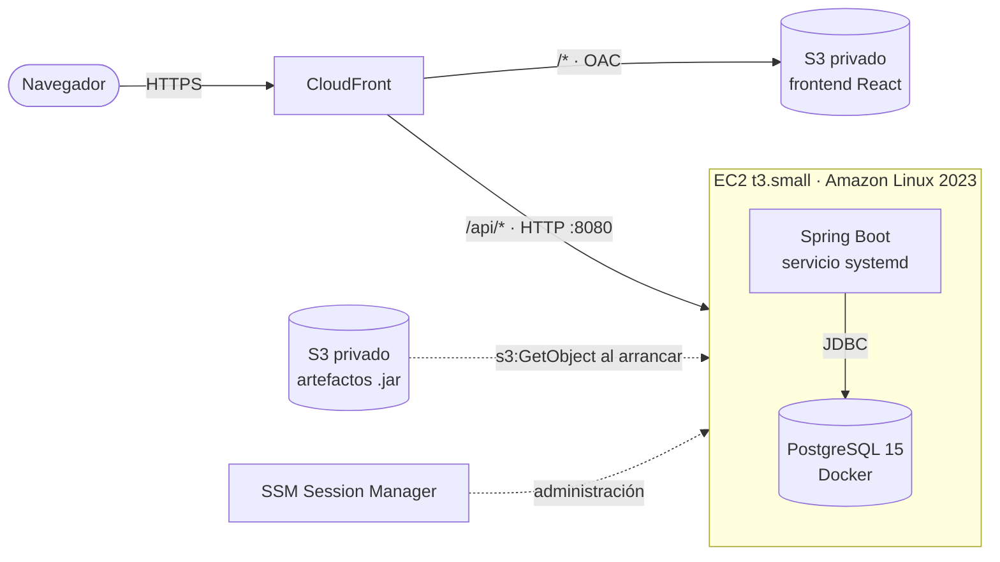
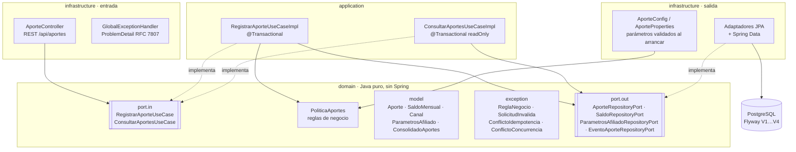
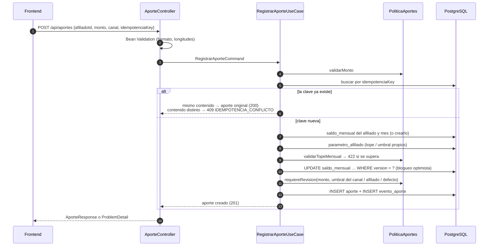
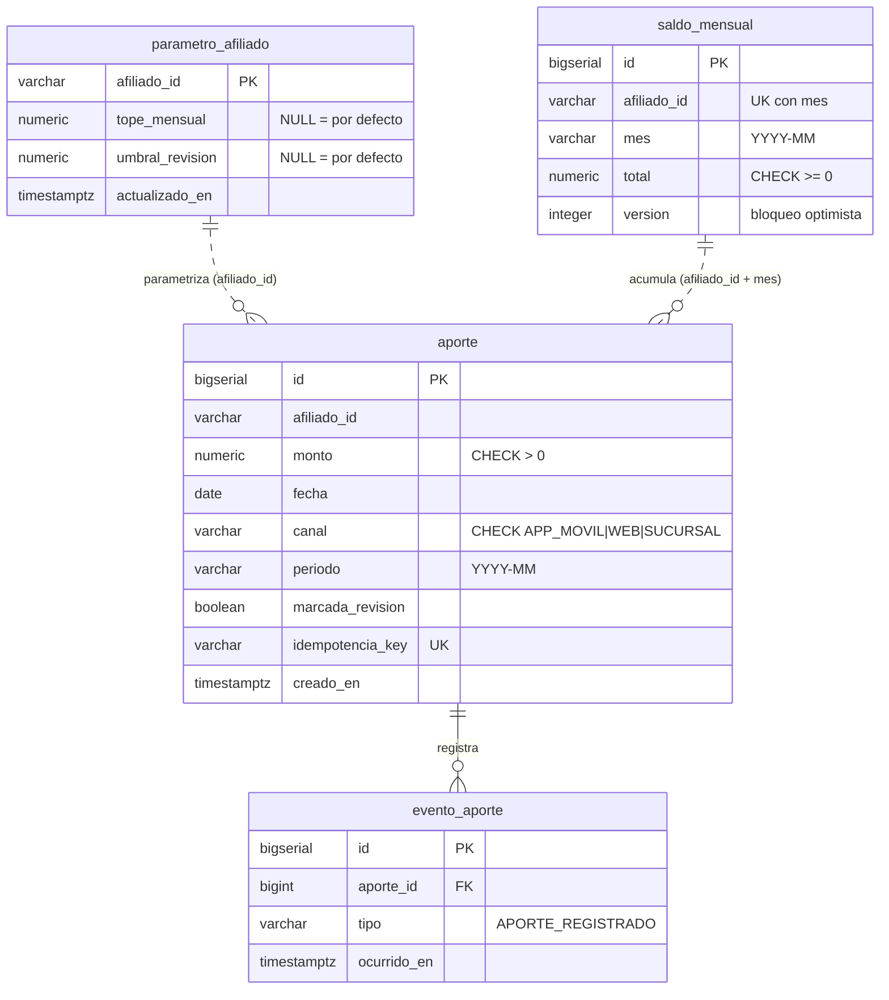

# Aportes Voluntarios · Reto B

Registro y consulta de aportes a un fondo voluntario: un backend en **Spring Boot 3.4 / Java 21** sobre **PostgreSQL**,
un frontend en **React 18 + Vite**, y el despliegue en **AWS** (CloudFront + S3 + EC2).

- **Registrar un aporte** de un afiliado: monto, canal (`APP_MOVIL`, `WEB`, `SUCURSAL`) y fecha asignada por el servidor.
  La operación es **idempotente**.
- **Reglas de negocio:** el monto debe ser positivo, hay un tope mensual por afiliado y los aportes que superan el umbral
  de revisión quedan marcados. Los aportes que violan una regla se rechazan con un mensaje claro.
- **Consultar el consolidado** de un afiliado en un rango de periodos: total y detalle.

> Todos los datos son sintéticos. Las decisiones de diseño, los ajustes de requisito y los pendientes para producción
> están en [NOTAS_PROCESO.md](NOTAS_PROCESO.md).

---

## 1. Arquitectura de despliegue (AWS · us-east-2)


```mermaid
flowchart LR
    U([Navegador]) -- HTTPS --> CF["CloudFront"]
    CF -- "/*  · OAC" --> S3[("S3 privado<br/>frontend React")]
    CF -- "/api/*  · HTTP :8080" --> EC2

    subgraph EC2 ["EC2 t3.small · Amazon Linux 2023"]
        API["Spring Boot<br/>servicio systemd"]
        DB[("PostgreSQL 15<br/>Docker")]
        API -- JDBC --> DB
    end

    S3A[("S3 privado<br/>artefactos .jar")] -. "s3:GetObject al arrancar" .-> EC2
    SSM["SSM Session Manager"] -. administración .-> EC2
```

- **Un solo dominio** de CloudFront sirve el frontend y la API. El frontend llama a la ruta relativa `/api`, así que no
  hace falta CORS.
- **S3 bloquea el acceso público**: solo esta distribución lo lee, mediante Origin Access Control.
- **La API no se cachea en CloudFront** (`/api/*`). Los assets del frontend llevan hash en el nombre y se cachean un año;
  `index.html` se revalida siempre.
- **El puerto 8080 de la EC2 solo admite tráfico de CloudFront**, gracias a la lista de prefijos administrada.
  El rol IAM de la instancia tiene permisos mínimos (SSM + lectura del jar).
- Los scripts de [infra/](infra/) crean, actualizan y destruyen todo con la AWS CLI (ver la sección 6).

---

## 2. Arquitectura del backend (Clean Architecture / hexagonal)


```mermaid
flowchart TB
    subgraph INFRA_IN ["infrastructure · entrada"]
        C["AporteController<br/>REST /api/aportes"]
        H["GlobalExceptionHandler<br/>ProblemDetail RFC 7807"]
    end

    subgraph APP ["application"]
        R["RegistrarAporteUseCaseImpl<br/>@Transactional"]
        Q["ConsultarAportesUseCaseImpl<br/>@Transactional readOnly"]
    end

    subgraph DOM ["domain · Java puro, sin Spring"]
        PIN[["port.in<br/>RegistrarAporteUseCase<br/>ConsultarAportesUseCase"]]
        POL["PoliticaAportes<br/>reglas de negocio"]
        MOD["model<br/>Aporte · SaldoMensual · Canal<br/>ParametrosAfiliado · ConsolidadoAportes"]
        EXC["exception<br/>ReglaNegocio · SolicitudInvalida<br/>ConflictoIdempotencia · ConflictoConcurrencia"]
        POUT[["port.out<br/>AporteRepositoryPort · SaldoRepositoryPort<br/>ParametrosAfiliadoRepositoryPort · EventoAporteRepositoryPort"]]
    end

    subgraph INFRA_OUT ["infrastructure · salida"]
        ADP["Adaptadores JPA<br/>+ Spring Data"]
        CFG["AporteConfig / AporteProperties<br/>parámetros validados al arrancar"]
    end

    PG[("PostgreSQL<br/>Flyway V1…V4")]

    C --> PIN
    R -. implementa .-> PIN
    Q -. implementa .-> PIN
    R --> POL
    R --> POUT
    Q --> POUT
    ADP -. implementa .-> POUT
    ADP --> PG
    CFG --> POL
```

**Las dependencias apuntan hacia el dominio.** El dominio no conoce Spring, JPA ni HTTP: define puertos (interfaces) y
la infraestructura los implementa.

| Capa | Paquete | Responsabilidad |
|---|---|---|
| **Dominio** | `domain.model` | Entidades y valores: `Aporte`, `SaldoMensual`, `Canal`, `ParametrosAfiliado`, `ConsolidadoAportes` |
| | `domain.service` | `PoliticaAportes`: monto válido, tope mensual, umbral de revisión |
| | `domain.port.in` / `port.out` | Contratos de los casos de uso y de la persistencia |
| | `domain.exception` | Errores de negocio con un `codigo` estable |
| **Aplicación** | `application.usecase` | Orquesta cada caso de uso dentro de una transacción |
| **Infraestructura** | `infrastructure.web` | Controlador REST, DTOs con Bean Validation y traducción de errores a HTTP |
| | `infrastructure.persistence` | Entidades JPA, repositorios Spring Data y adaptadores de los puertos |
| | `infrastructure.config` | Parámetros de negocio (`@ConfigurationProperties`), `Clock` en zona `America/Bogota` |

**CQRS ligero:** el comando (`RegistrarAporteUseCase`) y la consulta (`ConsultarAportesUseCase`) están separados. La
consulta corre en transacción de solo lectura.

### Flujo de registro de un aporte


```mermaid
sequenceDiagram
    autonumber
    participant F as Frontend
    participant C as AporteController
    participant U as RegistrarAporteUseCase
    participant P as PoliticaAportes
    participant DB as PostgreSQL

    F->>C: POST /api/aportes {afiliadoId, monto, canal, idempotenciaKey}
    C->>C: Bean Validation (formato, longitudes)
    C->>U: RegistrarAporteCommand
    U->>P: validarMonto
    U->>DB: buscar por idempotenciaKey
    alt la clave ya existe
        U-->>C: mismo contenido → aporte original (200)<br/>contenido distinto → 409 IDEMPOTENCIA_CONFLICTO
    else clave nueva
        U->>DB: saldo_mensual del afiliado y mes (o crearlo)
        U->>DB: parametro_afiliado (tope / umbral propios)
        U->>P: validarTopeMensual → 422 si se supera
        U->>DB: UPDATE saldo_mensual … WHERE version = ? (bloqueo optimista)
        U->>P: requiereRevision(monto, umbral del canal / afiliado / defecto)
        U->>DB: INSERT aporte + INSERT evento_aporte
        U-->>C: aporte creado (201)
    end
    C-->>F: AporteResponse o ProblemDetail
```

Todo el registro ocurre en **una transacción**: si algo falla, se revierten el saldo, el aporte y el evento.

### Concurrencia e idempotencia

- **El tope mensual se protege con bloqueo optimista** sobre `saldo_mensual.version`. Si dos aportes simultáneos del mismo
  afiliado y mes compiten, uno recibe **409 `CONFLICTO_CONCURRENCIA`** (con `Retry-After`).
- **El cliente reintenta con la misma `idempotenciaKey`**, así que el reintento no duplica el aporte. El frontend lo hace
  automáticamente.
- **Las carreras al crear el saldo del mes o al registrar la misma clave** las detienen las restricciones `UNIQUE` de la
  base de datos, y se traducen al mismo conflicto reintentable.
- **Probado contra PostgreSQL real:** 8 aportes concurrentes de 2.000.000 con tope de 10.000.000 → entran exactamente 5.

---

## 3. Reglas de negocio

| Regla | Comportamiento | Configuración |
|---|---|---|
| Monto | Mayor a cero, máximo 2 decimales | — |
| Tope mensual | Rechaza (422) si `acumulado del mes + monto > tope`. Llegar exacto al tope es válido | `parametro_afiliado.tope_mensual`; si es NULL → `aporte.tope-mensual` (10.000.000) |
| Umbral de revisión | Marca el aporte si `monto > umbral`. El umbral se resuelve así: **canal → afiliado → defecto** | `aporte.umbral-revision-por-canal.SUCURSAL` (3.000.000) → `parametro_afiliado.umbral_revision` → `aporte.umbral-revision` (5.000.000) |
| Fecha y periodo | Los asigna el servidor en la zona `America/Bogota` | `aporte.zona-horaria` |

### Contrato HTTP

| Método y ruta | Respuesta |
|---|---|
| `POST /api/aportes` | **201** creado · **200** reintento idempotente · **400** datos inválidos · **409** conflicto de idempotencia o concurrencia · **422** regla de negocio |
| `GET /api/aportes/consolidado?afiliadoId=&periodoDesde=YYYY-MM&periodoHasta=YYYY-MM` | **200** total y detalle · **400** periodos inválidos |

Los errores siguen RFC 7807 (`ProblemDetail`) e incluyen un `codigo` estable (`TOPE_MENSUAL_EXCEDIDO`, `MONTO_INVALIDO`,
`CANAL_INVALIDO`, `IDEMPOTENCIA_CONFLICTO`, `CONFLICTO_CONCURRENCIA`, …). Nunca exponen trazas ni detalles internos.

---

## 4. Modelo de datos


```mermaid
erDiagram
    aporte ||--o{ evento_aporte : "registra"
    parametro_afiliado ||..o{ aporte : "parametriza (afiliado_id)"
    saldo_mensual ||..o{ aporte : "acumula (afiliado_id + mes)"

    aporte {
        bigserial id PK
        varchar afiliado_id
        numeric monto "CHECK > 0"
        date fecha
        varchar canal "CHECK APP_MOVIL|WEB|SUCURSAL"
        varchar periodo "YYYY-MM"
        boolean marcada_revision
        varchar idempotencia_key UK
        timestamptz creado_en
    }
    saldo_mensual {
        bigserial id PK
        varchar afiliado_id "UK con mes"
        varchar mes "YYYY-MM"
        numeric total "CHECK >= 0"
        integer version "bloqueo optimista"
    }
    parametro_afiliado {
        varchar afiliado_id PK
        numeric tope_mensual "NULL = por defecto"
        numeric umbral_revision "NULL = por defecto"
        timestamptz actualizado_en
    }
    evento_aporte {
        bigserial id PK
        bigint aporte_id FK
        varchar tipo "APORTE_REGISTRADO"
        timestamptz ocurrido_en
    }
```

Flyway administra el esquema (`backend/src/main/resources/db/migration`, de V1 a V4) y Hibernate solo lo valida
(`ddl-auto=validate`).

---

## 5. Frontend

```
frontend/src
├── main.jsx                      punto de entrada + estilos
├── App.jsx                       encabezado y pestañas (Registrar / Consolidado)
├── api/aportesApi.js             fetch a /api, errores ProblemDetail, reintento ante CONFLICTO_CONCURRENCIA
├── components/
│   ├── RegistrarAporte.jsx       formulario, validación, clave de idempotencia por intento
│   └── ConsolidadoAportes.jsx    filtros por periodo, indicadores y tabla de detalle
├── formato.js                    moneda COP, separadores de miles es-CO, canales
└── styles.css                    estilos con variables (modo claro y oscuro)
```

- **La `idempotenciaKey` se genera una vez por intento de aporte** y se conserva entre reenvíos. Solo cambia cuando el
  usuario modifica los datos o cuando el registro termina bien.
- **El monto se escribe con separadores es-CO** (`1.500.000,50`) y se envía como texto decimal (`"1500000.50"`), para no
  perder precisión con números de punto flotante.
- En desarrollo, Vite redirige `/api` a `http://localhost:8080`. En AWS, CloudFront enruta `/api/*` a la EC2.

---

## 6. Cómo ejecutarlo

### Local

Requisitos: Java 21+, Node 20+ y un PostgreSQL local. Las pruebas de integración necesitan Docker (Testcontainers).

1. Crea la base de datos: `CREATE DATABASE proteccion_reto;`
2. Copia `backend/.env.example` como `backend/.env` y completa `DB_URL`, `DB_USER` y `DB_PASSWORD`.
3. Levanta el backend y el frontend:

```bash
cd backend && ./mvnw spring-boot:run
```
```bash
cd frontend && npm install && npm run dev
```
```bash
cd backend && ./mvnw test
```

Backend en `http://localhost:8080` y frontend en `http://localhost:5173`. Flyway crea las tablas al arrancar.

### AWS

Requiere Git Bash y la AWS CLI configurada. Los scripts están en [infra/](infra/):

| Script | Qué hace |
|---|---|
| `deploy.sh` | Crea todo (buckets, rol IAM, security group, EC2, OAC, CloudFront). Es reanudable |
| `actualizar-backend.sh` | Compila y prueba, sube el jar y reinicia el servicio vía SSM |
| `actualizar-frontend.sh` | Compila, sincroniza S3 e invalida `index.html` |
| `abrir-acceso-publico.sh` | Abre PostgreSQL (5432) y SSH (22) e instala una llave SSH. Solo para la demo |
| `destroy.sh` | Elimina todos los recursos, incluidos los datos |

---

## 7. Pruebas

43 pruebas, todas en verde:

| Suite | Qué cubre |
|---|---|
| `PoliticaAportesTest` | Bordes del tope y del umbral, umbral por canal contra el del afiliado, montos inválidos |
| `RegistrarAporteUseCaseImplTest` | Orquestación con puertos en memoria y reloj fijo: idempotencia, tope, parámetros por afiliado y por canal |
| `AporteIntegrationTest` | De punta a punta sobre PostgreSQL real (Testcontainers + Flyway): contrato HTTP, consolidado, concurrencia sobre el tope y la misma clave en paralelo |
| `RetoBApplicationTest` | Arranque del contexto de Spring |

---

## 8. Stack

| Capa | Tecnología |
|---|---|
| Backend | Spring Boot 3.4 · Java 21 · Spring Data JPA · Bean Validation · Flyway · Lombok |
| Base de datos | PostgreSQL 15 |
| Frontend | React 18 · Vite 6 · `fetch` nativo · CSS sin dependencias |
| Pruebas | JUnit 5 · AssertJ · MockMvc · Testcontainers |
| Infraestructura | AWS CloudFront · S3 · EC2 (Amazon Linux 2023) · IAM · SSM · Docker |
