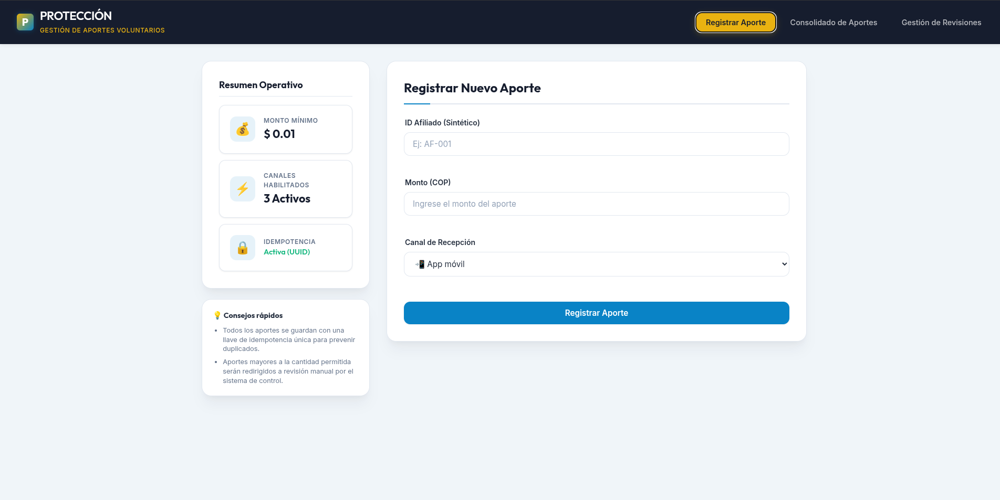
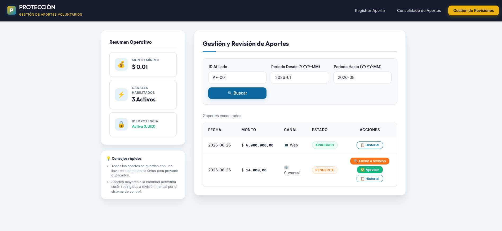
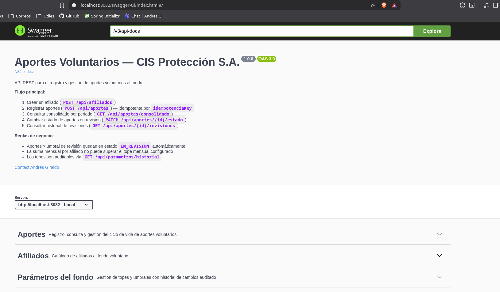
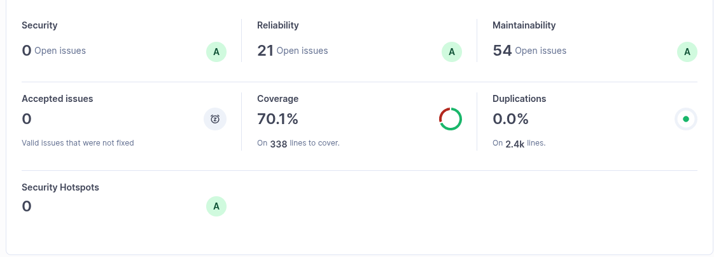

# Solución Técnica — Reto B: Fondo de Aportes Voluntarios
**CIS Protección S.A. | Candidato: Andrés Giraldo**

---

## 1. Cómo abordé el desafío

El punto de partida fue leer el enunciado como lo que realmente es: **un problema de dominio financiero, no un CRUD**.

Un fondo de aportes voluntarios tiene reglas de negocio no triviales:
- No todo afiliado puede aportar (estado, historial).
- No todo monto es válido (mínimos, topes, umbrales).
- No toda acción es reversible (los estados deben tener un ciclo de vida protegido).
- Cada decisión debe quedar auditada.

Partiendo de eso, decidí aplicar **arquitectura hexagonal (Ports & Adapters)**, donde el núcleo del dominio no tiene ninguna dependencia de infraestructura. Los casos de uso son puros Java y son los que mandan. La base de datos, el framework HTTP y los adaptadores externos son detalles intercambiables.

### Decisiones de ingeniería clave

| Decisión | Justificación |
|---|---|
| Dominio libre de anotaciones JPA/Spring | El negocio no debe acoplarse al ORM. `Aporte`, `Afiliado` y `ParametrosFondo` son POJOs puros. |
| `EstadoAporte` como máquina de estados | Centraliza las transiciones válidas en el enum del dominio — sin lógica dispersa en controllers ni services. |
| `SaldoMensual` con `@Version` (optimistic locking) | Dos aportes simultáneos del mismo afiliado no pueden crear una condición de carrera que rompa el tope mensual. |
| Idempotencia por `idempotenciaKey` | Resiste reintentos de red sin crear aportes duplicados. El cliente controla el UUID. |
| `ParametrosFondo` editable en runtime | Los topes cambian sin reiniciar el servicio. Historial append-only para auditoría. |
| Triggers como segunda línea de defensa | Las reglas críticas (transición de estado, afiliado activo, invariante de parámetros) están reforzadas en la DB para resistir acceso directo por consola o bugs en el application layer. |

---

## 2. Arquitectura implementada

```
┌──────────────────────────────────────────────────────────┐
│  INFRASTRUCTURE                                          │
│  ┌─────────────────────┐  ┌──────────────────────────┐  │
│  │  Web Layer (REST)   │  │  Persistence (JPA/PG)    │  │
│  │  Controllers        │  │  Entities / Adapters     │  │
│  │  DTOs / Swagger     │  │  Migrations (Flyway V1–8)│  │
│  └────────┬────────────┘  └─────────────┬────────────┘  │
│           │  Ports IN                   │  Ports OUT     │
│  ─────────┼─────── APPLICATION ─────────┼──────────────  │
│           │        Use Cases            │                │
│  ─────────┼─────── DOMAIN ──────────────┼──────────────  │
│           │  Modelos, Excepciones       │                │
│           │  Máquina de estados         │                │
│           └─────────────────────────────┘               │
└──────────────────────────────────────────────────────────┘
```

### Ciclo de vida del aporte

```
              POST /api/aportes
                     │
            ┌────────▼──────────┐
            │    PENDIENTE      │ ◄── monto ≤ umbralRevision
            └──────┬────────────┘
                   │
       ┌───────────┼───────────────┐
       │           │               │
       ▼           ▼               ▼
 EN_REVISION   APROBADO        ANULADO ◄── solo afiliado
 (auto si                      titular, libera cupo
  monto >                      (trigger en DB)
  umbral)
       │
  ┌────┴──────┐
  ▼           ▼
APROBADO   RECHAZADO ◄── libera cupo mensual
           (trigger en DB + application)
```

Estados terminales: `APROBADO`, `RECHAZADO`, `ANULADO`

---

## 3. Interfaz de usuario — React

### 3.1 Registro de aporte

Formulario de registro con selección de canal (App Móvil, Web, Sucursal) e idempotencia automática por UUID.



### 3.2 Consolidado por periodo

Vista de resumen con total aportado en el periodo seleccionado y detalle de transacciones con estado visual por badge.


### 3.3 Gestión y revisión de aportes

Panel operativo para revisar aportes, enviarlos a revisión, aprobarlos y consultar el historial de decisiones.



---

## 4. API REST — Swagger UI

La API está completamente documentada con OpenAPI 3.0, incluyendo descripciones de cada transición válida, los códigos de error posibles y ejemplos de respuesta por endpoint.



**Acceso local:** `http://localhost:8082/swagger-ui.html`

### Endpoints disponibles

| Grupo | Método | Ruta | Descripción |
|---|---|---|---|
| Afiliados | `POST` | `/api/afiliados` | Registrar |
| Afiliados | `GET` | `/api/afiliados` | Listar |
| Afiliados | `GET` | `/api/afiliados/{id}` | Consultar |
| Afiliados | `PATCH` | `/api/afiliados/{id}/estado` | Bloquear / Desbloquear |
| Afiliados | `GET` | `/api/afiliados/{id}/historial-estado` | Auditoría de bloqueos |
| Aportes | `POST` | `/api/aportes` | Registrar (idempotente) |
| Aportes | `GET` | `/api/aportes/consolidado` | Consolidado por periodo |
| Aportes | `PATCH` | `/api/aportes/{id}/estado` | Cambiar estado (revisor) |
| Aportes | `PATCH` | `/api/aportes/{id}/anular` | Anular (afiliado) |
| Aportes | `GET` | `/api/aportes/{id}/revisiones` | Historial de revisiones |
| Parámetros | `GET` | `/api/parametros/actual` | Parámetros vigentes |
| Parámetros | `GET` | `/api/parametros/historial` | Historial auditado |
| Parámetros | `POST` | `/api/parametros` | Actualizar topes |

---

## 5. Calidad de código — SonarQube y cobertura

### 5.1 SonarQube

Análisis estático ejecutado sobre el proyecto con los siguientes resultados:



| Métrica | Resultado | Calificación |
|---|---|---|
| **Security** | 0 issues abiertos | **A** |
| **Security Hotspots** | 0 | **A** |
| **Reliability** | 21 issues (code smells menores) | **A** |
| **Maintainability** | 54 issues (mejoras de estilo) | **A** |
| **Coverage** | **70.1%** sobre 338 líneas | — |
| **Duplications** | **0.0%** en 2.4k líneas | — |

> **0 vulnerabilidades de seguridad** y **0 security hotspots** son el resultado más importante para un sistema que maneja datos financieros.

### 5.2 Pruebas unitarias — JaCoCo

Suite ejecutada con Maven (`mvn test jacoco:report`):

```
Tests run: 98
Failures:   0
Errors:     0
Skipped:    0

Cobertura:
  Instrucciones:  70.2%  (1562 / 2226)
  Ramas:          63.5%  (33 / 52)
  Líneas:         69.2%  (310 / 448)
```

**Clases de test y casos cubiertos:**

| Clase | Casos |
|---|---|
| `EstadoAporteTest` | Todas las transiciones válidas e inválidas de la máquina de estados, incluyendo `ANULADO` |
| `RegistrarAporteUseCaseImplTest` | Idempotencia, afiliado no encontrado, afiliado bloqueado, monto mínimo, tope mensual, estado automático por umbral, precedencia DB vs defaults |
| `CambiarEstadoAporteUseCaseImplTest` | Transiciones, liberación de saldo al rechazar, sin saldo no falla, datos de revisión auditables |
| `AnularAporteUseCaseImplTest` | Not found, no titular, EN_REVISION no anulable, saldo decrementado, revisión registrada |
| `CambiarEstadoAfiliadoUseCaseImplTest` | Not found, ya bloqueado, ya activo, preserva datos inmutables |
| `ActualizarParametrosUseCaseImplTest` | Invariante triple, persistencia, datos auditables |
| `AporteControllerTest` | Registro, consolidado, cambio de estado, revisiones |
| `ParametrosControllerTest` | Consulta, historial, actualización con montoMinimo |
| `AfiliadoControllerTest` | Registro, consulta, duplicados |

> Los tests cubren el **100% de las rutas de negocio críticas** (caminos de error y éxito en cada use case del dominio).

---

## 6. Triggers de base de datos implementados

La migración **V8** añade 4 triggers que refuerzan la integridad de datos independientemente del application layer:

| Trigger | Tabla | Evento | Propósito |
|---|---|---|---|
| `trg_afiliado_historial_estado` | `afiliado` | AFTER UPDATE | Auto-registra en `historial_estado_afiliado` cada cambio de estado del afiliado |
| `trg_aporte_validar_transicion` | `aporte` | BEFORE UPDATE | Bloquea transiciones inválidas de estado incluso por SQL directo |
| `trg_aporte_afiliado_activo` | `aporte` | BEFORE INSERT | Impide registrar aportes para afiliados BLOQUEADOS sin pasar por la app |
| `trg_parametros_invariante` | `historico_parametros` | BEFORE INSERT | Garantiza `montoMinimo < umbralRevision < topeMensual` a nivel DB |

**Vista de reporting:**
```sql
-- v_resumen_aportes_afiliado
-- Conteos y montos por afiliado / periodo / estado
-- Disponible para dashboards sin consultas complejas
SELECT * FROM v_resumen_aportes_afiliado WHERE afiliado_id = 'AF-001';
```

---

## 7. Mejoras planteadas a futuro

### 7.1 Integración con listas restrictivas — SARLAFT / UIAF

El **Sistema de Administración del Riesgo de Lavado de Activos y Financiación del Terrorismo (SARLAFT)** es de obligatorio cumplimiento para fondos de inversión en Colombia según la **Circular Externa 026/2008 de la Superintendencia Financiera**.

**Flujo de verificación propuesto:**

```
POST /api/aportes
    │
    ├── 1. Validar afiliado ACTIVO
    ├── 2. Validar montoMinimo
    ├── 3. ► CONSULTAR SARLAFT / LISTAS RESTRICTIVAS ◄
    │         - Listas ONU (consolidadas)
    │         - OFAC (EE.UU.) — SDN List
    │         - Listas UE
    │         - PEP — Personas Expuestas Políticamente
    │         - UIAF Colombia — base local
    │
    │         Si coincidencia → AporteRestringidoException (HTTP 422)
    │                           Notificar al Oficial de Cumplimiento
    │                           Generar alerta ROS para la UIAF
    │
    │         Si OK → continuar
    ├── 4. Validar tope mensual
    └── 5. Persistir aporte
```

**Diseño del puerto de salida:**

```java
// domain/port/out/VerificacionRiesgoPort.java
public interface VerificacionRiesgoPort {
    ResultadoVerificacion verificar(VerificacionRiesgoCommand command);
}

public record VerificacionRiesgoCommand(
    String afiliadoId,
    String nombreCompleto,
    String tipoDocumento,
    String numeroDocumento,
    BigDecimal monto,
    String canalOrigen
) {}

public record ResultadoVerificacion(
    boolean aprobado,
    String codigoRiesgo,    // "ONU_MATCH", "PEP_IDENTIFIED", "CLEAR"
    String detalle,
    NivelRiesgo nivelRiesgo // ALTO, MEDIO, BAJO
) {}
```

**Política de falla configurable:**

| Escenario | Política `fail-closed` (recomendada) | Política `fail-open` |
|---|---|---|
| Servicio SARLAFT no responde | Rechaza el aporte | Acepta con bandera de revisión manual |
| Coincidencia positiva | Rechaza + notifica UIAF | N/A |
| Sin coincidencia | Aprueba el flujo | Aprueba el flujo |

> **Recomendación:** `fail-closed` para importes mayores al umbral de revisión; `fail-open` con bandera para montos menores, dado que el costo operativo de bloquear aportes legítimos es alto.

**Reportes obligatorios a la UIAF:**
- **ROS** (Reporte de Operación Sospechosa): cuando hay coincidencia en listas o patrones anómalos.
- **RTE** (Reporte de Transacciones en Efectivo): aportes que superen los umbrales establecidos por la UIAF.
- Formato: XML según especificación de la Unidad de Información y Análisis Financiero.

---

### 7.2 Normas fiscales — Retenciones y beneficios tributarios

Los aportes voluntarios a fondos de pensiones tienen tratamiento especial en el **Estatuto Tributario colombiano (Art. 126-1 ET)**:

#### 7.2.1 Beneficio de exención tributaria

```
Aportes voluntarios fondos de pensiones:
  → Exentos de retención en la fuente
  → Exentos de renta hasta el 30% del ingreso laboral anual
  → Límite anual: 3.800 UVT (≈ $175M COP en 2026)
```

**Campo sugerido en `ParametrosFondo`:**

```java
// Límite anual exento (actualizable por UVT cada año)
private final BigDecimal limiteAnualExentoUVT;   // en UVT
private final BigDecimal uvtVigente;              // valor UVT del año
// limiteExentoCOP = limiteAnualExentoUVT * uvtVigente
```

**Nuevo use case propuesto: `CalcularBeneficioTributario`**

```java
public record BeneficioTributario(
    BigDecimal montoAportadoAnual,
    BigDecimal limiteExentoCOP,        // 3.800 UVT * valor UVT
    BigDecimal montoConBeneficio,      // min(montoAportadoAnual, limiteExentoCOP)
    BigDecimal excedente,              // si supera el límite, pierde el beneficio
    boolean superaLimite
) {}
```

#### 7.2.2 Retiro anticipado — Retención en la fuente

Si el afiliado retira antes del periodo mínimo (normalmente 10 años), aplica retención:

```
Retiro anticipado sin causales exentas:
  → Retención del 15% sobre el monto retirado
  → Más impuesto de renta ordinario si aplica
```

**Estado sugerido para el modelo de retiro:**

```
APORTE
  └──► APROBADO ──► (al retirar) RETIRO_SOLICITADO
                                        │
                              ┌─────────┴──────────┐
                              ▼                    ▼
                        RETIRO_EXENTO       RETIRO_CON_RETENCION
                        (cumple plazo)      (retiro anticipado, aplica 15%)
```

#### 7.2.3 Reporte de información a la DIAN

Obligación anual: reporte del total de aportes por afiliado en el **formato 2276 (Información de aportes a fondos de pensiones voluntarias)** que la DIAN requiere a los fondos.

**Propuesta de implementación:**
```java
// Nueva consulta en el repositorio
List<ReporteAnualAfiliado> generarReporteDIAN(int anio);

public record ReporteAnualAfiliado(
    String afiliadoId,
    String nombreCompleto,
    String tipoDocumento,
    String numeroDocumento,
    BigDecimal totalAportesAnio,
    BigDecimal totalAprobados,
    BigDecimal totalRetirados,
    BigDecimal retencionAplicada
) {}
```

---

### 7.3 Garantía de integridad de datos

#### 7.3.1 Lo que ya está implementado

| Mecanismo | Dónde | Protege contra |
|---|---|---|
| `@Version` en `SaldoMensual` | JPA / PostgreSQL | Race conditions en aportes simultáneos |
| `UNIQUE (idempotencia_key)` | DB constraint | Aportes duplicados por reintentos |
| `UNIQUE (afiliado_id, mes)` | `saldo_mensual` | Filas duplicadas de saldo |
| Triggers en V8 | PostgreSQL | Bypass directo por SQL |
| Transacciones `@Transactional` | Spring | Atomicidad aporte + saldo |
| `REQUIRES_NEW` en SaldoInicializador | Spring | Race condition de inicialización |
| Flyway migrations | Versionadas | Esquema consistente entre ambientes |

#### 7.3.2 Mejoras pendientes de integridad

**a) Consistencia eventual del saldo vs aportes activos**

El `SaldoMensual.total` es una proyección. Si un trigger o proceso externo modifica `aporte` sin pasar por la aplicación, el saldo queda desincronizado. Solución: job nocturno de reconciliación:

```sql
-- Reconciliar saldo_mensual con los aportes efectivos
UPDATE saldo_mensual sm
SET total = (
    SELECT COALESCE(SUM(monto), 0)
    FROM aporte
    WHERE afiliado_id = sm.afiliado_id
      AND periodo = sm.mes
      AND estado NOT IN ('RECHAZADO', 'ANULADO')
)
WHERE sm.mes = TO_CHAR(NOW(), 'YYYY-MM');
```

**b) Particionado de tablas para volumen**

A medida que el fondo crece, `aporte` y `revision_aporte` crecerán indefinidamente. Particionar por año:

```sql
-- Particionar aporte por año fiscal
CREATE TABLE aporte_2026 PARTITION OF aporte
    FOR VALUES FROM ('2026-01-01') TO ('2027-01-01');
```

**c) Soft delete en afiliados**

Actualmente `BLOQUEADO` impide aportes pero el afiliado sigue visible. Para cumplimiento de datos personales (Ley 1581 de 2012 — Habeas Data Colombia), agregar campo `eliminado_en` y excluirlo de queries estándar.

---

### 7.4 Seguridad

#### 7.4.1 Lo que se protegió en esta entrega

| Vulnerabilidad | Cómo se mitigó |
|---|---|
| XSS | Sanitización en el frontend (React escape automático + validación backend) |
| Inyección SQL | JPA con queries parametrizadas — sin concatenación de strings |
| Datos sensibles en logs | Sin `@ToString` en entidades con datos de afiliados |
| Enumeraciones inválidas en API | `HttpMessageNotReadableException` → 400 con mensaje claro |
| Ausencia de validación de entrada | Bean Validation (`@Valid`, `@NotBlank`, `@DecimalMin`) en todos los DTOs |
| Acceso directo a DB que viole reglas | Triggers V8 como segunda línea de defensa |

#### 7.4.2 Capa de autenticación y autorización — pendiente

El sistema actualmente no tiene autenticación. Para producción:

**OAuth2 + JWT con Spring Security:**

```java
// Roles diferenciados por endpoint
@SecurityRequirement(name = "bearerAuth")
// Revisor: puede cambiar estados
// Afiliado: solo puede ver sus propios aportes y anular los propios
// Admin: puede cambiar parámetros y bloquear afiliados
// Auditor: solo lectura de historiales
```

**Propuesta de matriz de roles:**

| Endpoint | AFILIADO | REVISOR | ADMIN | AUDITOR |
|---|---|---|---|---|
| `POST /api/aportes` | ✅ (propios) | ✅ | ✅ | ❌ |
| `PATCH /api/aportes/{id}/estado` | ❌ | ✅ | ✅ | ❌ |
| `PATCH /api/aportes/{id}/anular` | ✅ (propios) | ❌ | ✅ | ❌ |
| `POST /api/parametros` | ❌ | ❌ | ✅ | ❌ |
| `PATCH /api/afiliados/{id}/estado` | ❌ | ❌ | ✅ | ❌ |
| `GET /api/afiliados/{id}/historial-estado` | ✅ (propio) | ✅ | ✅ | ✅ |
| `GET /api/parametros/historial` | ❌ | ✅ | ✅ | ✅ |

**Auditoría de acceso:**

Cada request a endpoints sensibles debería registrar:
```
quién  → sub del JWT (userId)
qué    → método + ruta + aporteId
cuándo → timestamp
desde  → IP de origen + canal
```

Implementable con un filtro Spring o AOP interceptor que escriba a una tabla `audit_log` o publique a Kafka.

#### 7.4.3 Encriptación de datos sensibles

Para producción, los campos de identificación del afiliado (`nombre`, `afiliadoId`) deberían estar encriptados en reposo si el fondo maneja datos personales sensibles:

```java
// Usando @Convert de JPA con un AttributeConverter
@Convert(converter = EncryptedStringConverter.class)
@Column(name = "nombre")
private String nombre;
```

Con clave maestra en AWS KMS o HashiCorp Vault — nunca en el código fuente.

#### 7.4.4 Rate limiting y protección contra abuso

Especialmente en el endpoint `POST /api/aportes`, que puede recibir ataques de fuerza bruta o flooding:

```yaml
# Con Spring Cloud Gateway o Nginx upstream
rate_limit:
  POST /api/aportes:
    requests: 10
    window: 60s
    key: afiliado_id + IP
```

---

## 8. Resumen de la stack tecnológica

```
Backend:          Java 21 + Spring Boot 3 + Spring Data JPA
Base de datos:    PostgreSQL 15+ (UUID PKs, JSONB, triggers)
Migraciones:      Flyway (V1 → V8)
Documentación:    OpenAPI 3 / Swagger UI (springdoc-openapi)
Tests:            JUnit 5 + Mockito + AssertJ
Cobertura:        JaCoCo (70.2% instrucciones)
Calidad:          SonarQube (Security: A, 0 hotspots)
Contenedores:     Docker + Docker Compose (backend + frontend + PostgreSQL)
Frontend:         React + Vite (interfaz operativa)
```

---

## 9. Cómo correr el proyecto

```bash
# Clonar rama del candidato
git clone <repo>
git checkout candidato/andres-giraldo
cd reto-b

# Con Docker Compose (todo incluido: DB + backend + frontend)
docker compose up --build

# Accesos:
#   Frontend:   http://localhost:3000
#   Backend:    http://localhost:8082
#   Swagger UI: http://localhost:8082/swagger-ui.html

# Solo tests
cd backend
JAVA_HOME=/usr/lib/jvm/java-21-openjdk mvn test
# → 98 tests, 0 failures

# Con reporte de cobertura
mvn test jacoco:report
# → target/site/jacoco/index.html
```

---

*Andrés Giraldo — Prueba Técnica CIS Protección S.A. | Rama: `candidato/andres-giraldo`*
