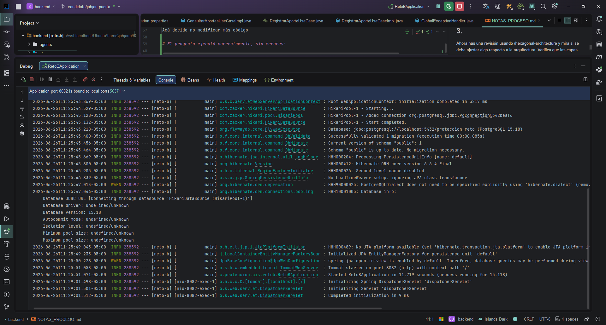
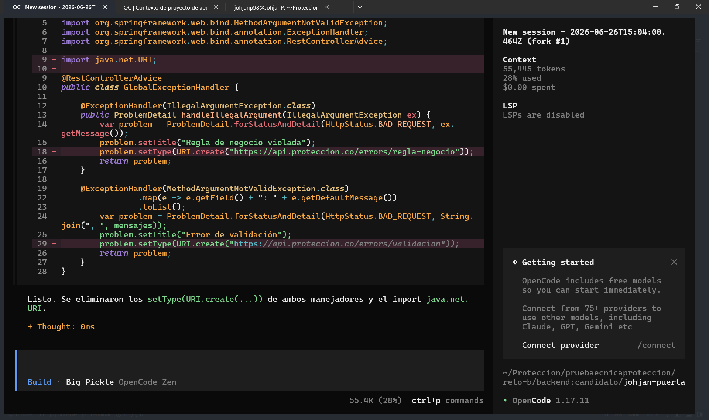

# Se usa OpenCode para el uso de agentes IA
## Skills
Inicialmente se instaló la skill para springboot: java-springboot
npx skills add https://github.com/github/awesome-copilot --skill java-springboot

Luego, se notó que existe una arquitectura hexagonal por lo que se usa también otra skill para el agente: hexagonal-architecture
px skills add https://github.com/affaan-m/everything-claude-code --skill hexagonal-architecture

# Prompts:
## 1.
Actúa como un desarrolador senior, experto en springboot. 
Tienes a tu cargo un proyecto sobre registro y consulta de aportes voluntarios construido con una 
arquitectura hexagonal. Debes crear una funcionalidad para registrar un aporte con las siguientes 
reglas de negocio: el monto debe ser positivo; existe un tope mensual por afiliado (parámetro configurable); 
un aporte que supere un umbral definido debe quedar marcado para revisión posterior. 
Aportes que violen las reglas se rechazan con un mensaje claro.
Importante que respetes la arquitectura, por lo que primero debes darle un vistazo, leer los archivos actuales 
y su ubicación. 
Ten en cuenta el uso de /java-springboot

**Resultado:** El agente crea la funcionalidad y la prueba. Sin embargo, noté que creó algo de lógica dentro 
del controlador por lo que decido cambiarlo para que quede limpio y sea más sencillo de mantener.

## 2.
Para mejorar un poco el código, no dejes lógica en el controlador. Ejemplo, en GET /consolidado, 
crea el query dentro de ConsultarAportesUseCase. Haz lo mismo con POST en su debida clase de uso

**Resultado:** El agente corrige y deja un código más limpio.

## 3.
Ahora has una revisión usando /hexagonal-architecture y mira si se debe ajustar algo respecto a la arquitectura. 
Verifica que las capas estén implementadas, no modifiques, solo dime qué cambios críticos se deben hacer.

**Resultado:** Con el fin de mejorar la arquitectura y dejar la responsabilidad de cada clase en su ubicación correcta, 
se le hizo la petición al agente y este listó pequeñas modificaciones poco relevantes. Reviso el código restante y
encuentro que en el manejo de errores globales se inyectó un enlace no válido por lo que procedo a eliminarlo. 
Acá decido no modificar más código

# El proyecto ejecutó correctamente, sin errores:

## Uso de opencode

